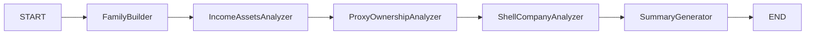

# Detection Service (Corruption Investigation Agent)

## Overview
The **Detection Service** functions as an AI-powered "Corruption Investigation Agent". It uses a multi-step reasoning process (powered by LangGraph) to analyze entities in the Knowledge Graph for potential corruption risks.

## Key Capabilities
The agent performs a sequential analysis pipeline:
1.  **Family Builder**: Reconstructs family trees and hidden relationships.
2.  **Income vs. Assets**: Compares declared income against owned assets to identify discrepancies.
3.  **Proxy Ownership**: Detects if assets are likely held by third parties (e.g., relatives, drivers, guards).
4.  **Shell Companies**: Identifies complex ownership structures designed to hide beneficial owners.
5.  **Summary**: Synthesizes all findings into a coherent report (in Ukrainian).

## Architecture
This service uses a **LangGraph** state machine to orchestrate specialized analysis "nodes".



## Setup

1.  **Install Dependencies**:
    The project uses `uv` or standard pip.
    ```bash
    pip install -r requirements.txt
    ```

2.  **Configuration**:
    Copy `.env.example` to `.env` and fill in your keys:
    ```bash
    cp .env.example .env
    ```
    *   Requires `OPENAI_API_KEY` (or LAPA/Local LLM config).
    *   Requires `NEO4J_URI` credentials to read the graph.

3.  **Run the Agent**:
    Use the CLI script to investigate a target:
    ```bash
    python3 scripts/run_corruption_agent.py "Ivanov Ivan Ivanovich" --verbose
    ```

## Development
*   **`agent/`**: Core logic (graph nodes, configuration, tools).
*   **`experiments/`**: Jupyter notebooks for testing new detection algorithms.
